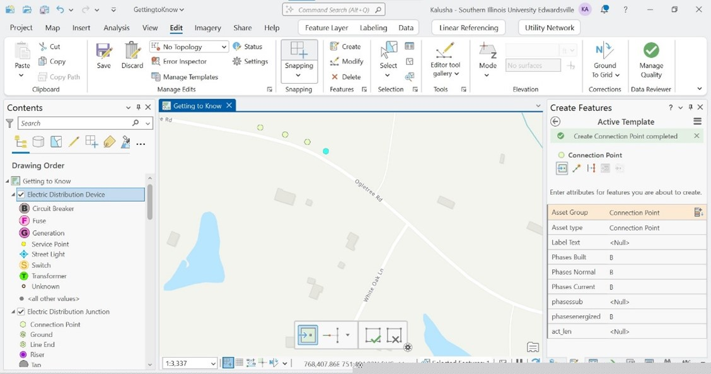
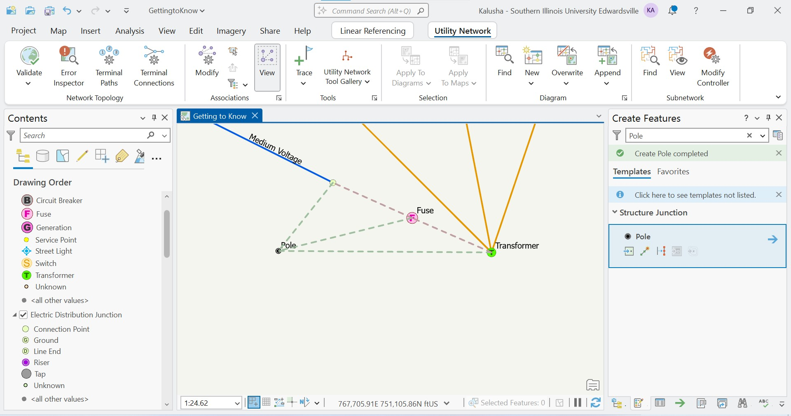
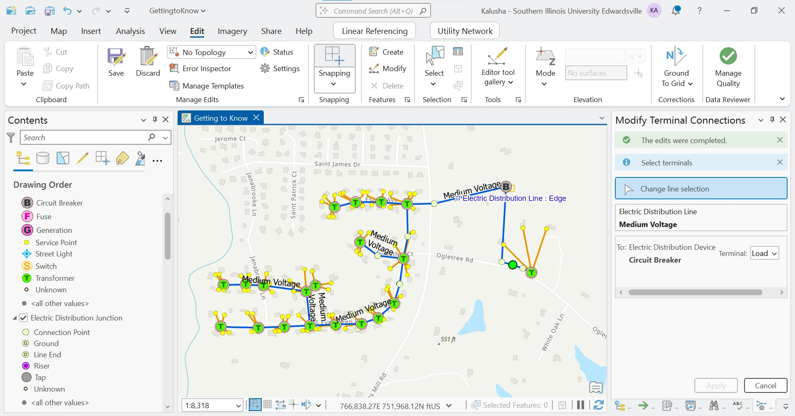

# ArcGIS Utility Network Analysis

## Overview
This project demonstrates the use of ArcGIS Pro Utility Network to model, manage, and analyze an electric distribution system.

The workflow includes creating network features, establishing connectivity and structural associations, validating topology, and performing network tracing.

---

## Tools Used
- ArcGIS Pro
- Utility Network

---

## Methods

### Feature Creation
- Created connection points, medium voltage lines, fuse, and transformer
- Modified feature templates to enforce correct attributes

---

### Network Topology
- Validated network topology to ensure correct connectivity
- Resolved dirty areas

---

### Associations
- Created connectivity associations between:
  - Connection points
  - Fuse
  - Transformer
- Applied terminal configurations

---

### Tracing
- Performed connected trace to verify network connectivity
- Identified correctly connected and disconnected features

---

### Subnetwork Modeling
- Created subnetworks and analyzed connectivity flow

---

## Skills Demonstrated
- Utility Network Modeling
- Network Topology Validation
- Connectivity Associations
- Network Tracing
- ArcGIS Pro

---

## Author
Kalusha Aguti
